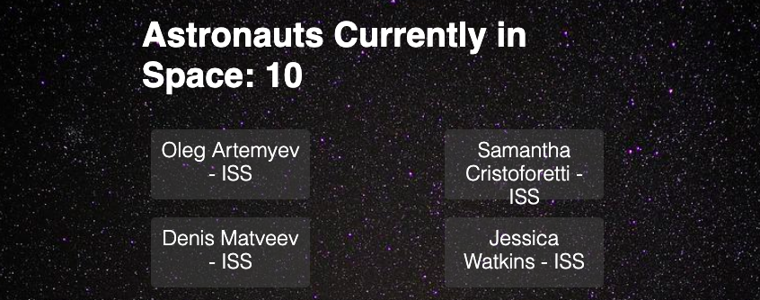

# Django Astronauts Tracker



## Installation:

1- Clone this repository in your desired path:

```
git clone https://github.com/JeanFerreira91/AstronautDjango.git
```

2- Create a virtual environment and activate it:

```
python3 -m venv venv
source venv/bin/activate
```

3- Install what's in requirements.txt:

```
pip install -r requirements.txt
```

4- Run your local server:

```
python manage.py runserver
```

See how many Astronauts are up there doing amazing work. All the data is provided for free by http://api.open-notify.org/

Enjoy!